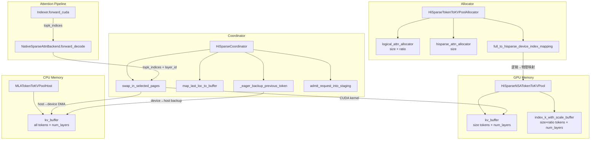

# 架构设计文档：SGLang HiSparse + DSA Indexer KV Cache 机制

## 1. 概述

HiSparse（Hierarchical Sparse）是 SGLang 中一种**分层稀疏注意力加速机制**，专为 DeepSeek 的 NSA（Native Sparse Attention）模型设计。其核心设计思想是：

> **Indexer 的 KV cache 常驻 GPU 显存（覆盖所有历史 token），而完整的 MLA KV cache 大部分存储在 CPU 内存中。Decode 时，Indexer 先扫描 GPU 上的全量 indexer key 计算 TopK 稀疏结果，再根据 TopK 结果从 CPU 按需加载选中 token 的完整 KV cache 到 GPU 的 device buffer 中，通过 LRU 热缓存减少实际传输量。**

### 1.1 核心源文件清单

| 文件路径 | 职责 |
|---------|------|
| `python/sglang/srt/managers/hisparse_coordinator.py` | HiSparse 协调器，管理 device buffer 分配、LRU swap-in、host 备份 |
| `python/sglang/srt/mem_cache/hisparse_memory_pool.py` | `HiSparseNSATokenToKVPool`（GPU 端）和 `HiSparseTokenToKVPoolAllocator`（双层分配器） |
| `python/sglang/srt/mem_cache/memory_pool.py` | `NSATokenToKVPool`（基类），定义 `index_k_with_scale_buffer` |
| `python/sglang/srt/mem_cache/memory_pool_host.py` | `MLATokenToKVPoolHost`（CPU 端 KV pool）和 `NSATokenToKVPoolHost`（含 indexer 备份） |
| `python/sglang/srt/layers/attention/nsa/nsa_indexer.py` | `Indexer` 模块，计算 TopK token positions |
| `python/sglang/srt/layers/attention/nsa_backend.py` | `NativeSparseAttnBackend`，调用 `swap_in_selected_pages` |
| `python/sglang/jit_kernel/hisparse.py` | JIT CUDA kernel 的 Python 包装层 |
| `python/sglang/jit_kernel/csrc/hisparse.cuh` | CUDA kernel 实现：LRU 热缓存 + host→device DMA |

---

## 2. 整体架构

### 2.1 分层存储架构图

```
┌─────────────────────────────────────────────────────────────────────────┐
│                           GPU 显存                                      │
│                                                                         │
│  ┌─────────────────────────────────────────────────────────────────┐    │
│  │  index_k_with_scale_buffer (size * host_to_device_ratio tokens) │    │
│  │  ─────────────────────────────────────────────────────────────  │    │
│  │  容量 = size × ratio（默认 2 倍）                                │    │
│  │  每 token = 132 bytes (FP8 key 128B + FP32 scale 4B)           │    │
│  │  每层独立 buffer，page_size=64                                   │    │
│  │  ★ 常驻 GPU，不参与 eviction/swap-in                            │    │
│  └─────────────────────────────────────────────────────────────────┘    │
│                                                                         │
│  ┌─────────────────────────────────────────────────────────────────┐    │
│  │  kv_buffer (size tokens, device buffer)                         │    │
│  │  ─────────────────────────────────────────────────────────────  │    │
│  │  容量 = size（较小，仅存热数据）                                  │    │
│  │  每 token = kv_cache_dim × dtype_size (bf16: 576×2=1152 bytes)  │    │
│  │  每层独立 buffer                                                 │    │
│  │  ★ LRU 热缓存，按需从 CPU swap-in                               │    │
│  └─────────────────────────────────────────────────────────────────┘    │
│                                                                         │
│  ┌─────────────────────────────────────────────────────────────────┐    │
│  │  辅助数据结构（per request, per layer）                          │    │
│  │  • req_device_buffer_tokens[layer, req, slot] — 缓存了哪些 token │    │
│  │  • req_device_buffer_token_locs[layer, req, slot] — 物理位置     │    │
│  │  • lru_slots[layer, req, slot] — LRU 排序（int16）              │    │
│  │  • req_to_device_buffer[req, slot] — device buffer 索引          │    │
│  │  • req_to_host_pool[req, token_pos] — host pool 索引             │    │
│  └─────────────────────────────────────────────────────────────────┘    │
│                                                                         │
└─────────────────────────────────────────────────────────────────────────┘

┌─────────────────────────────────────────────────────────────────────────┐
│                           CPU 内存 (pinned)                             │
│                                                                         │
│  ┌─────────────────────────────────────────────────────────────────┐    │
│  │  MLATokenToKVPoolHost.kv_buffer                                 │    │
│  │  ─────────────────────────────────────────────────────────────  │    │
│  │  容量 = device_size × host_to_device_ratio                      │    │
│  │  存储所有历史 token 的完整 MLA KV cache                          │    │
│  │  layout = "layer_first"，page_size = 1                          │    │
│  └─────────────────────────────────────────────────────────────────┘    │
│                                                                         │
│  （注意：HiSparse 模式下 CPU 端不存储 indexer buffer，                  │
│    因为 indexer 常驻 GPU。仅在 HiCache 模式下 NSATokenToKVPoolHost      │
│    才会在 CPU 端维护 indexer 备份。）                                    │
│                                                                         │
└─────────────────────────────────────────────────────────────────────────┘
```

### 2.2 组件关系图



---

## 3. 数据结构详解

### 3.1 Indexer KV Cache — `index_k_with_scale_buffer`

**定义位置**：`NSATokenToKVPool.__init__`（`memory_pool.py`）

```python
self.index_k_with_scale_buffer = [
    torch.zeros(
        (
            (index_buf_size + page_size + 1) // self.page_size,
            self.page_size * (index_head_dim + index_head_dim // self.quant_block_size * 4),
        ),
        dtype=torch.uint8,
        device=device,
    )
    for _ in range(layer_num)
]
```

**布局详解**：

| 维度 | 含义 | 典型值 |
|------|------|--------|
| dim 0 | 页数 = `(index_buf_size + page_size + 1) // page_size` | `(size*2 + 65) // 64` |
| dim 1 | 每页字节数 = `page_size * (128 + 128/128 * 4)` = `page_size * 132` | `64 * 132 = 8448` |

**页内数据布局**（page_size=64, head_dim=128, quant_block_size=128）：

```
Page i (8448 bytes):
├── [0, 64*128)       = 8192 bytes: FP8 key data (64 tokens × 128 dims)
└── [64*128, 64*132)  =  256 bytes: FP32 scale (64 tokens × 4 bytes)
                                     (每 128 个 FP8 值共享 1 个 scale)
```

**每 token 数据量**：128 (FP8 key) + 4 (FP32 scale) = **132 bytes**

**HiSparse 模式下的容量扩展**：

在 `HiSparseNSATokenToKVPool.__init__` 中：
```python
super().__init__(
    ...
    index_buf_size=size * host_to_device_ratio,  # 默认 2 倍
)
```

这意味着 **indexer buffer 的容量是 KV device buffer 的 `host_to_device_ratio` 倍**（默认 2 倍），因为 indexer 需要覆盖所有逻辑空间中的 token。

### 3.2 完整 MLA KV Cache — `kv_buffer`

**定义位置**：`MLATokenToKVPool._create_buffers`（`memory_pool.py`）

```python
self.kv_buffer = [
    torch.zeros(
        (self.size + self.page_size, 1, self.kv_cache_dim),
        dtype=self.store_dtype,
        device=self.device,
    )
    for _ in range(self.layer_num)
]
```

**kv_cache_dim 计算**：
- 非 FP8 模式：`kv_lora_rank + qk_rope_head_dim`（典型值 512 + 64 = 576）
- FP8 NSA 模式：使用 `override_kv_cache_dim`（包含量化 scale 的额外空间）

**每 token 数据量**（bf16）：576 × 2 = **1152 bytes**

### 3.3 显存占用对比

| 数据类型 | 每 token 字节数 | 容量（相对） | 总显存占比 |
|---------|---------------|------------|-----------|
| Indexer key | 132 B | 2N | 264N B |
| MLA KV cache | 1152 B (bf16) | N | 1152N B |
| **Indexer 占比** | | | **~18.7%** |

即使 indexer buffer 是 2 倍大小，其总显存占用仍然远小于 KV cache，这是 "indexer 优先留在显存" 策略可行的基础。

### 3.4 双层分配器 — `HiSparseTokenToKVPoolAllocator`

**定义位置**：`hisparse_memory_pool.py`

```python
class HiSparseTokenToKVPoolAllocator(BaseTokenToKVPoolAllocator):
    def __init__(self, size, page_size, dtype, device, kvcache, need_sort, host_to_device_ratio=2):
        self._size_full = size * host_to_device_ratio      # 逻辑空间大小
        self._size_hisparse = size                          # device buffer 大小

        self.logical_attn_allocator = PagedTokenToKVPoolAllocator(
            self._size_full, ...)                           # 管理逻辑索引
        self.hisparse_attn_allocator = PagedTokenToKVPoolAllocator(
            self._size_hisparse, ...)                       # 管理 device buffer 索引

        self.full_to_hisparse_device_index_mapping = torch.cat([
            torch.zeros(self._size_full + self.page_size, dtype=torch.int64, device=device),
            torch.tensor([-1], dtype=torch.int64, device=device),
        ])
```

**核心设计**：

1. **逻辑空间**（`logical_attn_allocator`）：大小 = `size * ratio`，对外暴露的索引空间，与 indexer buffer 容量一致
2. **物理空间**（`hisparse_attn_allocator`）：大小 = `size`，实际 GPU device buffer 的索引空间
3. **映射表**（`full_to_hisparse_device_index_mapping`）：逻辑索引 → device buffer 物理索引

**关键方法**：

- `alloc_extend()`：同时分配逻辑索引和 hisparse 物理索引，建立映射
- `alloc_decode()`：仅分配逻辑索引（decode 时 KV 写入 device buffer 的 reserved slot）
- `alloc_device_buffer()`：为 staging 完成的请求分配 device buffer 空间
- `free_hisparse()`：释放 device buffer 物理索引
- `available_size()`：返回 `min(logical.available, hisparse.available)`

---

## 4. Indexer 计算流程

### 4.1 Indexer 模块结构

**定义位置**：`nsa_indexer.py :: Indexer`

```python
class Indexer(MultiPlatformOp):
    def __init__(self, hidden_size, index_n_heads, index_head_dim, rope_head_dim, ...):
        self.wq_b = ReplicatedLinear(q_lora_rank, n_heads * head_dim)  # 1536 → 64×128 = 8192
        self.wk   = ReplicatedLinear(hidden_size, head_dim)            # 7168 → 128（单头）
        self.weights_proj = ReplicatedLinear(hidden_size, n_heads)     # 7168 → 64（head gate）
        self.k_norm = LayerNorm(head_dim)                              # LayerNorm(128)
        self.rotary_emb = get_rope_wrapper(rope_head_dim, ...)         # RoPE
```

**参数规模**（DeepSeek-V3 典型值）：
- `hidden_size` = 7168
- `index_n_heads` = 64
- `index_head_dim` = 128
- `rope_head_dim` = 64
- `q_lora_rank` = 1536
- `index_topk` = 2048

### 4.2 Forward 流程（Decode 模式）

```
forward_cuda(x, q_lora, positions, forward_batch, layer_id)
│
├── Step 1: 计算 Query 和 Key
│   ├── query = wq_b(q_lora)                    # (bs, 64×128)
│   │   └── reshape → (bs, 64, 128)
│   ├── key = k_norm(wk(x))                     # (bs, 128)
│   ├── q_rope, k_rope = rotary_emb(positions, q_rope, k_rope)
│   ├── query = rotate_activation(query)         # Hadamard transform
│   └── key = rotate_activation(key)             # Hadamard transform
│
├── Step 2: 存储 Indexer Key Cache
│   └── _store_index_k_cache(forward_batch, layer_id, key)
│       ├── 优先路径: fused_store_index_k_cache(key, buf, out_cache_loc, page_size)
│       │   └── JIT CUDA kernel: bf16 key → FP8 量化 → 写入 index_k_with_scale_buffer
│       └── 回退路径: act_quant(key) → set_index_k_scale_buffer()
│
├── Step 3: 计算 Head Gate Weights
│   └── weights = _get_logits_head_gate(x, q_scale)
│       ├── weights_proj(x) → (bs, 64)           # 每个 head 一个 gate
│       ├── weights *= n_heads^(-0.5)
│       └── weights = weights * q_scale * softmax_scale
│
├── Step 4: FP8 Paged MQA Logits（扫描所有历史 indexer key）
│   └── _get_topk_paged(forward_batch, layer_id, q_fp8, weights, metadata)
│       ├── kv_cache_fp8 = get_index_k_with_scale_buffer(layer_id)
│       │   └── 从 GPU 显存直接读取（常驻，无需传输）
│       ├── q_fp8 = q_fp8.unsqueeze(1)           # (bs, 1, 64, 128)
│       ├── kv_cache_fp8 = kv_cache_fp8.view(-1, 64, 1, 132)
│       └── logits = deep_gemm.fp8_paged_mqa_logits(
│               q_fp8, kv_cache_fp8, weights, seqlens, block_tables, ...)
│           └── 输出: (bs, max_seq_len) float32 注意力分数
│
└── Step 5: TopK 选择
    └── topk_result = metadata.topk_transform(logits, index_topk)
        ├── HiSparse 模式: force_unfused_topk = True
        │   └── fast_topk_v2(logits, seq_lens, topk)
        │       └── 返回原始 token position indices（非 fused page table）
        └── 输出: (bs, 2048) int32 — TopK token positions
```

### 4.3 关键设计点：force_unfused_topk

**定义位置**：`nsa_backend.py :: NativeSparseAttnBackend.get_indexer_metadata`

```python
def get_indexer_metadata(self, layer_id, forward_batch):
    force_unfused = (
        forward_batch.hisparse_coordinator is not None
        and forward_batch.forward_mode.is_decode_or_idle()
    )
    return NSAIndexerMetadata(
        ...,
        force_unfused_topk=force_unfused,
    )
```

**原因**：HiSparse 需要原始的 **token position indices**（如 `[42, 1337, 8192, ...]`），而非 fused 的 page table indices。这些 position indices 会传给 `swap_in_selected_pages` 来确定需要从 CPU 加载哪些 token 的 KV cache。

### 4.4 Dual Stream 优化

Indexer 支持双 CUDA stream 并行：

```python
enable_dual_stream = (
    self.alt_stream is not None
    and get_is_capture_mode()
    and q_lora.shape[0] > 0
    and q_lora.shape[0] <= DUAL_STREAM_TOKEN_THRESHOLD  # 1024
)
```

当启用时：
- **主 stream**：计算 query（wq_b 投影 + RoPE + Hadamard）
- **alt stream**：计算 key（wk 投影 + LayerNorm + RoPE + Hadamard）
- 两个 stream 通过 `wait_stream` 同步
- DeepGEMM 使用 `half_device_sm_count` 限制 SM 数量避免争抢

---

## 5. HiSparse Decode 完整流程

### 5.1 流程总览

```
┌──────────────────────────────────────────────────────────────────────────┐
│                    HiSparse Decode 一步完整流程                           │
├──────────────────────────────────────────────────────────────────────────┤
│                                                                          │
│  ① map_last_loc_to_buffer()                                              │
│     ├── _eager_backup_previous_token()                                   │
│     │   ├── 跳过首次 decode（staging 已备份所有 prefill token）           │
│     │   ├── 分配 host pool slot                                          │
│     │   ├── 记录 req_to_host_pool[req, token_pos] = host_loc            │
│     │   └── backup_from_device_all_layer(device_locs → host_locs)        │
│     │       └── 同时备份 KV cache（所有层，一次 kernel 调用）             │
│     │                                                                    │
│     ├── _grow_device_buffers()                                           │
│     │   ├── 短序列（seq_len ≤ device_buffer_size）：按需扩展 buffer      │
│     │   └── 返回 reserved_buffer_loc（新 token 的 device buffer slot）   │
│     │                                                                    │
│     └── 更新 full_to_hisparse_device_index_mapping[out_cache_loc]        │
│         └── = reserved_buffer_loc                                        │
│                                                                          │
│  ② 模型 Forward（逐层执行）                                              │
│     │                                                                    │
│     ├── Layer i: Indexer.forward_cuda()                                   │
│     │   ├── 计算 q_fp8, key_bf16                                         │
│     │   ├── _store_index_k_cache(): key → FP8 写入 GPU indexer buffer    │
│     │   │   └── 写入位置 = out_cache_loc（逻辑索引，indexer buffer 足够大）│
│     │   ├── fp8_paged_mqa_logits(): 扫描 GPU indexer buffer 全部 key     │
│     │   └── topk_transform(): 选出 TopK token positions                  │
│     │       └── force_unfused = True → 返回原始 position indices          │
│     │                                                                    │
│     ├── Layer i: NativeSparseAttnBackend.forward_decode()                 │
│     │   ├── set_mla_kv_buffer(): 写入新 token 的 KV 到 device buffer     │
│     │   │   └── loc 经过 translate_loc_to_hisparse_device 映射            │
│     │   │                                                                │
│     │   ├── swap_in_selected_pages(req_pool_indices, seq_lens,            │
│     │   │                          topk_indices, layer_id)                │
│     │   │   ├── CUDA kernel: load_cache_to_device_buffer_mla             │
│     │   │   │   ├── 短序列快速路径（seq_len ≤ HOT_BUFFER_SIZE）          │
│     │   │   │   ├── Hash 查找 device buffer hit                          │
│     │   │   │   ├── LRU 排序：hit → MRU 端，evictable → LRU 端          │
│     │   │   │   ├── Miss 处理：驱逐 LRU slot，host→device DMA            │
│     │   │   │   └── 返回 TopK 在 device buffer 中的物理位置              │
│     │   │   └── 返回 page_table_1（device buffer 物理索引）               │
│     │   │                                                                │
│     │   └── Sparse Attention: 只对 TopK token 做 attention               │
│     │       └── 使用 flashmla_sparse / fa3 / tilelang / trtllm 等后端    │
│     │                                                                    │
│     └── ... 重复所有层 ...                                                │
│                                                                          │
└──────────────────────────────────────────────────────────────────────────┘
```

### 5.2 Request 生命周期

```
┌─────────┐     ┌──────────┐     ┌──────────┐     ┌──────────┐
│ Prefill  │────▶│ Staging  │────▶│  Decode  │────▶│ Finished │
│          │     │          │     │          │     │          │
│ 分配逻辑 │     │ 异步备份 │     │ 逐步     │     │ 释放所有 │
│ 索引 +   │     │ 所有 KV  │     │ decode   │     │ 资源     │
│ hisparse │     │ + indexer │     │          │     │          │
│ 物理索引 │     │ 到 CPU   │     │          │     │          │
└─────────┘     └──────────┘     └──────────┘     └──────────┘
```

**Staging 阶段**（`admit_request_into_staging`）：
1. 获取 prefill 阶段写入的 device buffer 物理索引
2. 分配 host pool 空间
3. 在 `write_staging_stream` 上异步执行 `backup_from_device_all_layer`
4. 备份完成后，调用 `alloc_device_buffer` 分配 decode 用的 device buffer
5. 设置 `_skip_first_backup[req] = True`（首次 decode 不需要备份）

**Direct-to-Host 路径**（`admit_request_direct`）：
- 用于 KV 数据已通过 RDMA 直接写入 host pool 的场景
- 跳过 staging DMA
- 短序列：预加载所有 token 到 device buffer
- 长序列：重置 device_buffer_tokens 为 -1，让 swap-in kernel 按需加载

---

## 6. swap_in_selected_pages — CUDA Kernel 详解

### 6.1 调用链

```python
# hisparse_coordinator.py
def swap_in_selected_pages(self, req_pool_indices, seq_lens, top_k_result, layer_id):
    load_cache_to_device_buffer_mla(
        top_k_tokens=top_k_result,
        device_buffer_tokens=self.req_device_buffer_tokens[layer_id],
        host_cache_locs=self.req_to_host_pool,
        device_buffer_locs=self.req_device_buffer_token_locs[layer_id],
        host_cache=self.mem_pool_host.kv_buffer[layer_id],
        device_buffer=self.mem_pool_device.kv_buffer[layer_id],
        top_k_device_locs=top_k_indices,
        req_pool_indices=req_pool_indices,
        seq_lens=seq_lens,
        lru_slots=self.lru_slots[layer_id],
        item_size_bytes=self.mem_pool_host.token_stride_size,
        num_top_k=self.top_k,
        hot_buffer_size=self.device_buffer_size,
        page_size=1,
        block_size=block_size,
        num_real_reqs=self.num_real_reqs,
    )
```

### 6.2 CUDA Kernel 架构

**模板参数**：
```cpp
template <int BLOCK_SIZE, int NUM_TOP_K, int HOT_BUFFER_SIZE, bool IsMLA, typename SeqLensT>
__global__ void load_cache_to_device_buffer_kernel(...)
```

- `BLOCK_SIZE`：线程块大小（默认 1024）
- `NUM_TOP_K`：TopK 数量（如 2048）
- `HOT_BUFFER_SIZE`：device buffer 大小（如 4096）
- `IsMLA`：MLA 模式（true 时只传 K，因为 MLA 的 K 和 V 是同一个 compressed representation）

**每个 block 处理一个 request**。

### 6.3 Kernel 执行流程

```
Phase 0: 短序列快速路径
├── if seq_len ≤ HOT_BUFFER_SIZE:
│   └── 所有 token 都在 device buffer 中
│       └── 直接查表 req_device_buffer_locs[token_pos] → 返回
│
Phase 1: 构建 Hash Table
├── 将 TopK tokens 插入 shared memory open-addressing hash table
│   ├── hash_size = NUM_TOP_K * 2（2 倍空间减少冲突）
│   ├── hash_slot = (key * 2654435761u) % hash_size（Knuth 乘法哈希）
│   └── 特殊处理 newest_token（seq_len - 1）：
│       └── 绑定到 newest_slot（HOT_BUFFER_SIZE 位置的 reserved slot）
│
Phase 2: 扫描 Device Buffer，识别 Hit/Miss
├── 遍历 device buffer 的所有 slot（按 LRU 顺序）
├── 对每个 slot 的 token 在 hash table 中查找
├── Hit: 记录 device buffer 位置到 top_k_device_locs
├── Evictable: 标记为可驱逐
├── 使用 warp-level ballot + prefix scan 统计 hit/evict 数量
└── 重排 LRU 顺序：
    ├── Hits → MRU 端（数组尾部）
    └── Evictables → LRU 端（数组头部）
│
Phase 3: 处理 Miss（Host→Device DMA）
├── 识别所有 miss token（不在 device buffer 中的 TopK token）
├── 为每个 miss 分配一个 evictable slot（从 LRU 端取）
├── 更新 device_buffer_tokens[evict_slot] = miss_token
├── 每个 warp 负责一个 miss token 的数据传输：
│   └── transfer_item_warp(lane_id, src_addr, dst_addr, item_size_bytes)
│       ├── src = host_cache[host_cache_locs[miss_token]]
│       ├── dst = device_buffer[device_buffer_locs[evict_slot]]
│       └── 使用 ld.global.nc.b64 / st.global.cg.b64 指令
│           └── 每个 warp（32 线程）并行传输 item_size_bytes / 8 个 uint64
└── MLA 优化：IsMLA=true 时只传 K（不传 V）
```

### 6.4 Shared Memory 布局

```cpp
template <int NUM_TOP_K, int HOT_BUFFER_SIZE>
struct SmemLayout {
    static constexpr int HASH_SIZE = NUM_TOP_K * 2;
    static constexpr int NUM_BUFFER_CHUNKS = (HOT_BUFFER_SIZE + WARP_SIZE - 1) / WARP_SIZE;

    // int32 区域：
    //   s_top_k_tokens[NUM_TOP_K]           — TopK token positions / miss scratch
    //   s_chunk_offset[NUM_BUFFER_CHUNKS+1]  — hit 计数前缀和
    //   s_evict_chunk_offset[NUM_BUFFER_CHUNKS+1] — evict 计数前缀和
    //   s_hash_keys[HASH_SIZE]              — hash table keys
    //   s_total_hits                        — 总 hit 数
    //   s_newest_hit                        — newest token 是否 hit

    // int16 区域：
    //   s_lru_slots_out[HOT_BUFFER_SIZE]    — 重排后的 LRU 顺序
    //   s_hash_vals[HASH_SIZE]              — hash table values (TopK index)
};
```

**动态 shared memory 大小**：
```
BYTES = TOTAL_INT32 * 4 + TOTAL_INT16 * 2
```
当超过 48KB 时，使用 `cudaFuncSetAttribute` 设置最大动态 shared memory。

### 6.5 稀疏性收益分析

| 参数 | 典型值 |
|------|--------|
| seq_len | 100,000 |
| top_k | 2,048 |
| device_buffer_size | 4,096 |
| kv_cache_dim (bf16) | 1,152 bytes/token |

- **每步 decode 最大传输量**：2048 个 miss × 1152 bytes = **2.36 MB**
- **实际传输量**（LRU hit 后）：通常远小于此，因为连续 decode 步骤的 TopK 有大量重叠
- **对比全量 KV**：100K × 1152 = 115.2 MB → **节省 ~98%**

---

## 7. Layer-wise 处理机制

### 7.1 每层独立的 LRU 状态

```python
# hisparse_coordinator.py :: __init__
self.req_device_buffer_tokens = torch.full(
    (layer_num, max_num_reqs, self.padded_buffer_size), -1, dtype=torch.int32, device=device)
self.req_device_buffer_token_locs = torch.full(
    (layer_num, max_num_reqs, self.padded_buffer_size), -1, dtype=torch.int32, device=device)
self.lru_slots = self._lru_init.view(1, 1, -1).repeat(layer_num, max_num_reqs, 1).contiguous()
```

**每层独立维护**：
- `req_device_buffer_tokens[layer_id]`：该层 device buffer 中缓存了哪些 token
- `req_device_buffer_token_locs[layer_id]`：该层 device buffer 的物理位置
- `lru_slots[layer_id]`：该层的 LRU 排序

**设计原因**：虽然 TopK selection 由 Indexer 统一计算（每层独立计算 TopK），但不同层的 attention pattern 可能不同，导致不同层的 LRU 状态不同。

### 7.2 Indexer Buffer 不参与逐层传输

**关键区别**：

| 数据 | 是否逐层 swap-in | 原因 |
|------|-----------------|------|
| `kv_buffer` | ✅ 是 | 每层独立调用 `swap_in_selected_pages(layer_id)` |
| `index_k_with_scale_buffer` | ❌ 否 | 常驻 GPU，容量 = size × ratio，覆盖所有逻辑 token |

在 `swap_in_selected_pages` 中，只操作 `mem_pool_host.kv_buffer[layer_id]` 和 `mem_pool_device.kv_buffer[layer_id]`，**indexer buffer 完全不在 swap-in 的数据路径中**。

### 7.3 Indexer 的 layer_transfer_counter

```python
# memory_pool.py :: NSATokenToKVPool
def get_index_k_with_scale_buffer(self, layer_id):
    if self.layer_transfer_counter is not None:
        self.layer_transfer_counter.wait_until(layer_id - self.start_layer)
    return self.index_k_with_scale_buffer[layer_id - self.start_layer]
```

这个机制用于 **HiCache**（非 HiSparse）模式下的 layer-wise 传输同步。在 HiSparse 模式下，indexer buffer 常驻 GPU，`layer_transfer_counter` 通常为 `None`，不需要等待。

### 7.4 逐 Token 备份机制

```python
# hisparse_coordinator.py :: _eager_backup_previous_token
def _eager_backup_previous_token(self, seq_lens, req_pool_indices, ...):
    # 跳过 staging 后的首次 decode
    if self._skip_first_backup[req_idx]:
        self._skip_first_backup[req_idx] = False
        continue

    # 上一步 token 的位置
    actual_token_pos = seq_lens[i] - 2
    buffer_slot = actual_token_pos.clamp(max=self.device_buffer_size)

    # 从 device buffer 读取
    device_locs = self.req_to_device_buffer[req, buffer_slot]

    # 分配 host slot 并备份
    host_locs = self.mem_pool_host.alloc(len(device_locs))
    self.req_to_host_pool[req, actual_token_pos] = host_locs
    self.mem_pool_host.backup_from_device_all_layer(
        self.mem_pool_device, host_locs, device_locs, io_backend="kernel")
```

**设计要点**：
- 每步 decode 备份**上一步**新生成的 token（而非当前步）
- 备份包括**所有层**的 KV cache（一次 kernel 调用）
- 使用 `backup_from_device_all_layer` 而非逐层备份，减少 kernel launch 开销
- 短序列（slot < device_buffer_size）：从 buffer 的对应位置读取
- 长序列（slot = device_buffer_size）：从 reserved slot 读取

---

## 8. Indexer 优先留在显存的完整机制

### 8.1 机制总结

```
┌──────────────────────────────────────────────────────────────────┐
│                "Indexer 优先留在显存" 的 5 个关键环节              │
├──────────────────────────────────────────────────────────────────┤
│                                                                  │
│  ① 容量设计：                                                    │
│     index_k_with_scale_buffer 大小 = size × ratio（2 倍）        │
│     kv_buffer 大小 = size（1 倍）                                │
│     → indexer 覆盖所有逻辑 token，KV 只存热数据                   │
│                                                                  │
│  ② 写入路径：                                                    │
│     _store_index_k_cache() 写入 out_cache_loc（逻辑索引）         │
│     → indexer buffer 足够大，直接写入，无需映射                    │
│     set_mla_kv_buffer() 写入 translate_loc_to_hisparse_device()  │
│     → KV 写入需要逻辑→物理映射                                    │
│                                                                  │
│  ③ 读取路径：                                                    │
│     Indexer: get_index_k_with_scale_buffer(layer_id)             │
│     → 直接从 GPU 显存读取，无需任何传输                           │
│     KV: swap_in_selected_pages() → CUDA kernel host→device DMA  │
│     → 按需从 CPU 加载                                            │
│                                                                  │
│  ④ Eviction 隔离：                                               │
│     swap_in_selected_pages 只操作 kv_buffer                      │
│     index_k_with_scale_buffer 完全不在 eviction 路径中            │
│                                                                  │
│  ⑤ TopK 强制 unfused：                                           │
│     force_unfused_topk = True（HiSparse decode 模式）            │
│     → 返回原始 token position indices                             │
│     → 传给 swap_in_selected_pages 确定需要加载哪些 token          │
│                                                                  │
└──────────────────────────────────────────────────────────────────┘
```

### 8.2 translate_loc_to_hisparse_device 映射

**Extend（prefill）阶段**：

```python
# nsa_backend.py :: forward_extend
if forward_batch.hisparse_coordinator is not None:
    page_table_1 = forward_batch.token_to_kv_pool.translate_loc_to_hisparse_device(page_table_1)
```

**Decode 阶段**：

```python
# nsa_backend.py :: forward_decode
if forward_batch.hisparse_coordinator is not None:
    page_table_1 = forward_batch.hisparse_coordinator.swap_in_selected_pages(
        forward_batch.req_pool_indices,
        forward_batch.seq_lens,
        topk_indices,
        layer.layer_id,
    )
```

Decode 时不需要 `translate_loc_to_hisparse_device`，因为 `swap_in_selected_pages` 直接返回 device buffer 中的物理位置。

### 8.3 set_kv_buffer 的 HiSparse 重写

```python
# hisparse_memory_pool.py :: HiSparseNSATokenToKVPool
def set_kv_buffer(self, layer, loc, cache_k, cache_v):
    loc = self.translate_loc_to_hisparse_device(loc)  # 逻辑→物理
    super().set_kv_buffer(layer, loc, cache_k, cache_v)

def set_mla_kv_buffer(self, layer, loc, cache_k_nope, cache_k_rope):
    loc = self.translate_loc_to_hisparse_device(loc)  # 逻辑→物理
    super().set_mla_kv_buffer(layer, loc, cache_k_nope, cache_k_rope)
```

所有 KV 写入操作都经过逻辑→物理映射，确保写入正确的 device buffer 位置。

---

## 9. Device Buffer 管理

### 9.1 Buffer 布局

```
Device Buffer (per request):
┌─────────────────────────────────────────────────────┬──────────┐
│  HOT_BUFFER_SIZE slots (LRU managed)                │ Reserved │
│  [slot 0] [slot 1] ... [slot device_buffer_size-1]  │ [newest] │
│  ← LRU 端                              MRU 端 →    │          │
└─────────────────────────────────────────────────────┴──────────┘
                                                       ↑
                                              padded_buffer_size = device_buffer_size + page_size
```

- **HOT_BUFFER_SIZE** 个 slot：由 LRU 策略管理，存储热点 token
- **Reserved slot**（位置 = HOT_BUFFER_SIZE）：存储当前 decode 步的新 token
- `padded_buffer_size = device_buffer_size + page_size`

### 9.2 短序列 vs 长序列

| 场景 | 条件 | 行为 |
|------|------|------|
| 短序列 | `seq_len ≤ device_buffer_size` | 所有 token 都在 device buffer 中，CUDA kernel 直接查表返回 |
| 长序列 | `seq_len > device_buffer_size` | 需要 LRU + swap-in，每步最多加载 top_k 个 miss token |

### 9.3 _grow_device_buffers

```python
def _grow_device_buffers(self, seq_lens, req_pool_indices, ...):
    # 短序列且当前容量不够 → 扩展
    short_reqs_cpu = seq_lens_cpu <= self.device_buffer_size
    needs_grow_cpu = short_reqs_cpu & (seq_lens_cpu > current_caps)

    if torch.any(needs_grow_cpu):
        # 批量分配新的 device buffer 索引
        all_new_indices = self.token_to_kv_pool_allocator.hisparse_attn_allocator.alloc(total_grow)
        # 更新 req_to_device_buffer 和 req_device_buffer_token_locs
```

短序列在增长过程中逐步扩展 device buffer，直到达到 `device_buffer_size`。

---

## 10. HiSparse 与 HiCache 的区别

| 特性 | HiSparse | HiCache |
|------|----------|---------|
| **目标** | 稀疏注意力 + 分层缓存 | 纯分层缓存（无稀疏性） |
| **Indexer buffer** | 常驻 GPU（2 倍容量） | 逐层从 CPU 传输 |
| **KV cache 加载** | 按 TopK 稀疏加载 | 按层全量加载 |
| **CUDA kernel** | `load_cache_to_device_buffer_mla`（LRU + DMA） | `transfer_kv_*` 系列 |
| **CPU 端 indexer** | 不需要（GPU 常驻） | `NSATokenToKVPoolHost` 维护备份 |
| **layer_transfer_counter** | 不使用（indexer 常驻） | 使用（等待逐层传输完成） |
| **Coordinator** | `HiSparseCoordinator` | `CacheController` |

---

## 11. CUDA Graph 支持

### 11.1 Pre-allocated Buffers

```python
# hisparse_coordinator.py :: __init__
self.top_k_device_locs_buffer = torch.full(
    (max_num_reqs, self.top_k), -1, dtype=torch.int32, device=device)
self.num_real_reqs = torch.zeros(1, dtype=torch.int32, device=device)
```

- `top_k_device_locs_buffer`：预分配的输出 buffer，避免 CUDA graph 中的内存分配
- `num_real_reqs`：标量 tensor，在 graph replay 前更新，让 padded blocks 提前退出

### 11.2 Kernel 中的 Early Exit

```cpp
const int bid = blockIdx.x;
if (bid >= num_real_reqs[0]) return;  // padded blocks 直接退出
```

---

## 12. 性能关键路径分析

### 12.1 Decode 延迟分解

```
map_last_loc_to_buffer()
├── _eager_backup_previous_token()     ~0.1ms (device→host DMA, 1 token × all layers)
├── _grow_device_buffers()             ~0.01ms (CPU 逻辑 + 可能的 alloc)
└── mapping update                     ~0.01ms

Per-layer:
├── Indexer.forward_cuda()
│   ├── wq_b + wk projections         ~0.05ms
│   ├── RoPE + Hadamard               ~0.02ms
│   ├── _store_index_k_cache()         ~0.01ms
│   ├── fp8_paged_mqa_logits()         ~0.1-0.5ms (取决于 seq_len)
│   └── topk_transform()              ~0.01ms
│
├── swap_in_selected_pages()           ~0.05-0.2ms (取决于 miss 数量)
│   └── host→device DMA per miss      ~0.001ms per token
│
└── Sparse Attention                   ~0.05ms (只对 TopK token)

Total per layer: ~0.3-0.8ms
Total 61 layers: ~18-49ms
```

### 12.2 LRU Hit Rate 的重要性

连续 decode 步骤中，TopK 的重叠率通常很高（>80%），这意味着：
- 大部分 TopK token 已经在 device buffer 中（hit）
- 实际需要从 CPU 加载的 miss token 很少
- LRU 策略确保最近使用的 token 不被驱逐

---

## 13. 错误处理与边界情况

### 13.1 Host Pool 分配失败

```python
host_locs = self.mem_pool_host.alloc(len(device_locs))
if host_locs is None:
    logger.error("HiSparse: host mem pool alloc failed for %d tokens", len(device_locs))
    raise RuntimeError(f"HiSparse host mem pool alloc failed for {len(device_locs)} tokens")
```

### 13.2 Device Buffer 分配失败

```python
buffer_indices = self.token_to_kv_pool_allocator.alloc_device_buffer(allocated_indices, alloc_size)
if buffer_indices is None:
    raise RuntimeError("HiSparse alloc_device_buffer returned None")
```

### 13.3 Request 中止

```python
def abort_staging_request(self, req):
    # 从 staging 队列移除
    self.ack_staging_queue = [act for act in self.ack_staging_queue if act.req is not req]
    # 等待 in-flight DMA 完成
    self.write_staging_stream.synchronize()
    # 释放 host 内存
    host_indices = self.req_to_host_pool[req.req_pool_idx, :req.kv_allocated_len]
    host_indices = host_indices[host_indices >= 0]
    if host_indices.numel() > 0:
        self.mem_pool_host.free(host_indices)
```

### 13.4 TP 同步

```python
# collect_ready_reqs 中的 TP 同步
if self.tp_world_size > 1:
    torch.distributed.all_reduce(
        queue_size, op=torch.distributed.ReduceOp.MIN, group=self.tp_group)
```

确保所有 TP worker 看到相同的 staging 完成状态。

---

## 14. 配置参数

| 参数 | 默认值 | 含义 |
|------|--------|------|
| `host_to_device_ratio` | 2 | indexer buffer 和逻辑空间相对 device buffer 的倍数 |
| `device_buffer_size` | 配置指定 | 每个 request 的 device buffer slot 数量 |
| `top_k` | 2048 | Indexer 选出的 TopK token 数量 |
| `page_size` | 64 (CUDA) / 1 (ROCm) | KV cache 的页大小 |
| `block_size` | 1024 | CUDA kernel 的线程块大小 |
| `SGLANG_NSA_FUSE_TOPK` | env var | 是否 fuse topk transform（HiSparse 强制 unfused） |
